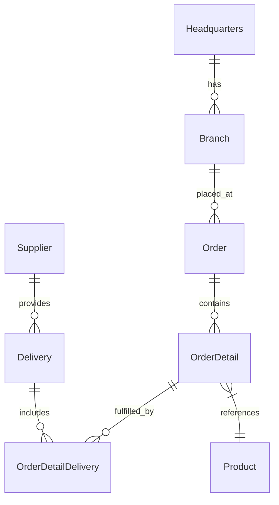

# 🚀 OctoCAT Supply: The Ultimate GitHub Copilot Demo v1.13.0


Welcome to the OctoCAT Supply Website - your go-to demo for showcasing the incredible capabilities of GitHub Copilot, GHAS, and the power of AI-assisted development!

## ✨ What Makes This Demo Special

This isn't just another demo app - it's a carefully crafted showcase that demonstrates the full spectrum of GitHub's AI capabilities:

- 🤖 **Copilot Agent Mode & Vision** - Watch Copilot understand UI designs and implement complex features across multiple files
- 🎭 **MCP Server Integration** - Demonstrate extended capabilities with Playwright for testing and GitHub API integration
- 🛡️ **Security First** - Showcase GHAS scanning and Copilot-powered vulnerability fixes
- 🧪 **Test Generation** - Exhibit Copilot's ability to analyze coverage and generate meaningful tests
- 🔄 **CI/CD & IaC** - Generate deployment workflows and infrastructure code with natural language
- 🎯 **Custom Instructions** - Show how Copilot can be tailored to understand internal frameworks and standards

## 🏗️ Architecture

The application is built using modern TypeScript with a clean separation of concerns:



### Tech Stack
- **Frontend**: React 18+, TypeScript, Tailwind CSS, Vite
- **Backend**: Express.js, TypeScript, OpenAPI/Swagger
- **DevOps**: Docker

## 🎯 Key Demo Scenarios

1. **Vibe Coding**
   - Implement a shopping cart from a design mockup
   - Watch Copilot analyze, plan, and implement across multiple files
   - Show real-time UI updates and state management

2. **Automated Testing**
   - Generate BDD feature files
   - Create and execute Playwright tests
   - Enhance unit test coverage with intelligent test generation

3. **Security and Best Practices**
   - Scan for vulnerabilities using GHAS
   - Generate automated fixes
   - Implement security best practices with Copilot guidance

4. **DevOps Automation**
   - Generate GitHub Actions workflows
   - Create infrastructure as code
   - Set up container deployments

## 🚀 Getting Started

1. Clone this repository
2. Build the projects:
   ```bash
   # Build API and Frontend
   npm install && npm run build
   ```
-3. Start the application:
   ```bash
   npm run dev
   ```

Run in Docker / Containers
--------------------------

If you'd prefer to run the whole project inside containers (recommended for demos or consistent environments), this repo includes Dockerfiles and a `docker-compose.yml` at the project root. The API defaults to port 3000 and the frontend to 5137 when run with the compose file.

PowerShell-friendly quick start (build and run):

```powershell
# build images and start containers in the background
docker-compose up --build -d

# follow logs for both services
docker-compose logs -f

# stop and remove containers, networks and volumes created by compose
docker-compose down
```

If you prefer to run containers manually (one-off):

```powershell
# build the images (from repo root)
docker build -f api/Dockerfile -t octocat-api:local ./api
docker build -f frontend/Dockerfile -t octocat-frontend:local ./frontend

# run the API (map port 3000)
docker run --rm -p 3000:3000 --name octocat-api octocat-api:local

# in another shell, run the frontend (map port 5137)
docker run --rm -p 5137:5137 --name octocat-frontend octocat-frontend:local
```

Notes and tips
- The compose setup maps ports so you can open the frontend in your browser at http://localhost:5137 and the API at http://localhost:3000 by default.
- On Windows, run PowerShell as Administrator if you run into permission or port binding errors.
- If you need to pass environment variables (for example a different API URL or a production build flag), create a `.env` file next to `docker-compose.yml` or pass them inline with `docker-compose` (see `docker-compose --help`).
- To rebuild just one service with compose without affecting others:

```powershell
docker-compose build api
docker-compose up -d api
```

- For logs of a single service:

```powershell
docker-compose logs -f frontend
```

- If you want a clean slate (remove containers and volumes):

```powershell
docker-compose down --volumes --remove-orphans
```

Or use the VS Code tasks:
- `Cmd/Ctrl + Shift + P` -> `Run Task` -> `Build All`
- Use the Debug panel to run `Start API & Frontend`

## 🛠️ MCP Server Setup (Optional)

To showcase extended capabilities:

1. Install Docker/Podman for the GitHub MCP server
2. Use VS Code command palette:
   - `MCP: List servers` -> `playwright` -> `Start server`
   - `MCP: List servers` -> `github` -> `Start server`
3. Configure with a GitHub PAT (required for GitHub MCP server)

## 📚 Documentation

- [Detailed Architecture](./docs/architecture.md)
- [Complete Demo Script](./docs/demo-script.md)

## 🎓 Pro Tips for Solution Engineers

- Practice the demos before customer presentations
- Remember Copilot is non-deterministic - be ready to adapt
- Mix and match demo scenarios based on your audience
- Keep your GitHub PAT handy for MCP demos

---

*This entire project, including the hero image, was created using AI and GitHub Copilot! Even this README was generated by Copilot using the project documentation.* 🤖✨
